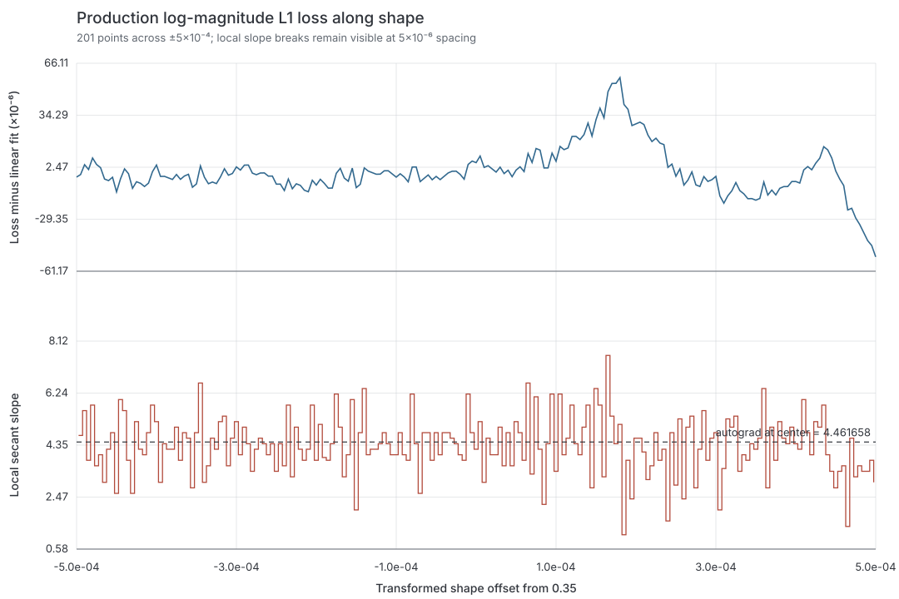

# SynthID E0 Gradient Prerequisites Finding

## Status: PASS

Investigated 2026-07-12.

Every E0 parameter passes the `< 1e-2` relative-error gate at the real
32,768-frame, four-window configuration. This includes the previously untested
time-varying cutoff path (`fBase`, `fAmt`, `fDecay`), direct PolyBLEP `shape`
and moving `pw`, `res`, and the bbb3769 constant-cutoff regression. E1 was not
started.

## Voice and smooth probe

The E0-only `subtractive-bass` voice directly transcribes the eseq PolyBLEP
macros:

```text
statefulPhasor(f0=110 Hz)
  -> (1-shape) * polyblepSaw(phase, f0)
     + shape * polyblepPulse(phase, pw, f0)
  -> low-pass biquad(
       cutoff=fBase + fAmt * exp(-t/fDecay),
       resonance=res)
  -> fixed smooth VCA envelope
  -> softsign
```

The spectral probe uses 44.1 kHz, 32,768 frames, Hann windows
`[256, 512, 1024, 2048]`, hop `window/4`, log epsilon `1e-3`, and the genuinely
smooth objective:

```text
smoothLogMagnitude = 0.5 * log(re*re + im*im + epsilon*epsilon)
loss = L2(smoothLogMagnitude(student), smoothLogMagnitude(target))
```

Production log-L1 is unchanged.

## Protocol correction: waveform parameters

The original transformed-coordinate sweep was frozen at:

```text
[1e-4, 1.5e-4, 2e-4, 3e-4, 5e-4,
 1e-3, 2e-3, 3e-3, 5e-3, 1e-2, 3e-2, 1e-1]
```

It remains authoritative for filter parameters: the first adjacent pair whose
two FD/autograd errors and FD-pair disagreement are all below `1e-2` passes.

For `shape`, however, signed FD residuals bracketed autograd at small epsilon
and became one-sided only at larger epsilon:

| Epsilon | FD - autograd |
|---:|---:|
| 1e-6 | -0.95624 |
| 2e-6 | +3.81212 |
| 1e-5 | -0.57478 |
| 2e-5 | -0.19331 |
| 5e-5 | +0.26446 |
| 1e-4 | +0.11187 |
| 1.5e-4 | +1.07824 |
| 3e-4 | -1.02619 |
| 1e-3 | -2.54319 |

The decisive isolation rendered the actual centered voice tangent
`v = d(signal)/d(shape)` and checked the spectral loss on `x + alpha*v`. An
independent NumPy float64 implementation reproduced the large-epsilon curvature
but converged cleanly at small epsilon:

| Epsilon | Float64 FD | Float64 analytic | Relative error |
|---:|---:|---:|---:|
| 1e-6 | 29.595239 | 29.595211 | 9.21e-7 |
| 2e-6 | 29.595320 | 29.595211 | 3.68e-6 |
| 5e-5 | 29.666559 | 29.595211 | 2.40e-3 |
| 1e-4 | 29.929140 | 29.595211 | 1.12e-2 |
| 1.5e-4 | 30.655448 | 29.595211 | 3.46e-2 |
| 3e-4 | 28.583497 | 29.595211 | 3.42e-2 |

Thus the old full-voice float32 central difference had no usable epsilon:
`1e-4` was already outside the local linear region, while smaller loss
differences were cancellation-limited. This was a measurement failure, not a
wrong adjoint.

Before running `pw`, the waveform-parameter gate was changed once and frozen
as a chain-rule decomposition:

1. full-voice time-domain MSE FD checks `d(signal)/d(param)` under the same
   fixed-grid adjacent-pair rule;
2. an actual voice tangent rendered with fixed `directionEpsilon=1e-4` checks
   the smooth spectral input adjoint;
3. full-voice Metal autograd, directional Metal autograd, and independent
   float64 analytic directional derivative must agree pairwise below `1e-2`;
4. float64 central differences at `1e-6 / 2e-6` must agree with the analytic
   result and each other below `1e-2`.

This changes the instrument, not the error bar. It is mathematically equivalent
to the end-to-end derivative by the chain rule and separately tests both halves.
The DGen C backend remains float32; it was not represented as a float64
reference.

## E0 results

### Filter parameters and constant-cutoff regression

| Parameter | Accepted epsilon pair | FD gradients | Autograd gradients | Worst FD/autograd error | FD-pair disagreement | Verdict |
|---|---|---|---|---:|---:|---|
| `fBase` | 1e-4 / 1.5e-4 | -17.051697 / -17.191568 | -17.074150 / -17.074133 | 6.831e-3 | 8.136e-3 | **PASS** |
| `fAmt` | 1e-4 / 1.5e-4 | -10.395050 / -10.388692 | -10.398911 / -10.398906 | 9.822e-4 | 6.116e-4 | **PASS** |
| `fDecay` | 3e-4 / 5e-4 | -13.300577 / -13.366698 | -13.365163 / -13.365169 | 4.832e-3 | 4.947e-3 | **PASS** |
| `res` | 2e-4 / 3e-4 | -7.734299 / -7.737477 | -7.675896 / -7.675895 | 7.959e-3 | 4.108e-4 | **PASS** |
| constant `noiseCutoff` (bbb3769) | 5e-4 / 1e-3 | -0.264257 / -0.263404 | -0.263843 / -0.263843 | 1.663e-3 | 3.228e-3 | **PASS** |

The constant-cutoff row uses the ordinary 808 voice with target cutoff
2,800 Hz and evaluation cutoff 1,800 Hz, so the biquad coefficient is constant
in time but the check is away from the loss minimum. The historical
`BPTTBiquadScratchTests.testLinearLossFDComparison` also passes; its original
5% tolerance is retained only as a regression smoke test, not as the E0 gate.

### PolyBLEP waveform parameters

| Parameter | Time-domain accepted pair | Time FD gradients | Time autograd | Worst time error | Time FD-pair disagreement | Verdict |
|---|---|---|---:|---:|---:|---|
| `shape` | 1e-4 / 1.5e-4 | -1915.2832 / -1931.9661 | approximately -1923.594 | 4.334e-3 | 8.636e-3 | **PASS** |
| `pw` | 1.5e-4 / 2e-4 | 2196.8586 / 2208.8623 | approximately 2216.880 | 9.031e-3 | 5.434e-3 | **PASS** |

| Parameter | Full-voice Metal autograd | Directional Metal autograd | Float64 analytic | Worst pairwise error | Float64 FD errors at 1e-6 / 2e-6 | Verdict |
|---|---:|---:|---:|---:|---:|---|
| `shape` | 29.566480 | 29.595312 | 29.595211 | 9.742e-4 | 9.21e-7 / 3.68e-6 | **PASS** |
| `pw` | 114.968430 | 115.057750 | 115.058519 | 7.829e-4 | 1.96e-6 / 7.85e-6 | **PASS** |

`pw` therefore validates the existing modulo derivative through
`fallingPhase = wrap(phase - width, 0, 1)` and the direct PolyBLEP quadratics.
No custom adjoint or oscillator substitution is used.

## Supporting production-L1 evidence

The earlier 201-point production log-L1 sweep directly shows its dense local
slope breaks:



The CSV and plotting script remain supporting evidence only; the intentionally
non-smooth production objective is not the E0 gradient gate.

## Exact reproduction

Build and render the subtractive target:

```sh
swift build -c release --product SynthID

.build/release/SynthID render \
  --profile subtractive-bass --frames 32768 \
  --params Examples/SynthID/E0_TARGET_PARAMS.json \
  --out /tmp/synthid-e0/target.wav
```

Standard smooth-probe check (substitute parameter and epsilon from the table):

```sh
.build/release/SynthID train \
  --profile subtractive-bass \
  --target /tmp/synthid-e0/target.wav \
  --out /tmp/synthid-e0/fBase-eps-0.0001 \
  --frames 32768 --windows 256,512,1024,2048 \
  --params Examples/SynthID/E0_EVAL_PARAMS.json \
  --fdcheck-log-l2 --fd-eps 0.0001 --fdcheck fBase
```

Waveform time-domain component:

```sh
.build/release/SynthID train \
  --profile subtractive-bass \
  --target /tmp/synthid-e0/target.wav \
  --out /tmp/synthid-e0/pw-time-eps-0.00015 \
  --frames 32768 --windows 256,512,1024,2048 \
  --params Examples/SynthID/E0_EVAL_PARAMS.json \
  --fdcheck-time-mse --fd-eps 0.00015 --fdcheck pw
```

Actual-voice directional component and float64 reference:

```sh
.build/release/SynthID train \
  --profile subtractive-bass \
  --target /tmp/synthid-e0/target.wav \
  --out /tmp/synthid-e0/pw-directional \
  --frames 32768 --windows 256,512,1024,2048 \
  --params Examples/SynthID/E0_EVAL_PARAMS.json \
  --fdcheck-log-l2 --fdcheck-directional \
  --direction-eps 0.0001 --fd-eps 0.00001 --fdcheck pw

python3 Examples/SynthID/scripts/analysis/e0_directional_reference.py \
  --dir /tmp/synthid-e0/pw-directional --param pw
```

Constant-cutoff regression at the real E0 configuration:

```sh
.build/release/SynthID render \
  --profile 808 --frames 32768 \
  --params Examples/SynthID/E0_TARGET_PARAMS.json \
  --out /tmp/synthid-e0/constant-target.wav

.build/release/SynthID train \
  --profile 808 \
  --target /tmp/synthid-e0/constant-target.wav \
  --out /tmp/synthid-e0/noiseCutoff-eps-0.0005 \
  --frames 32768 --windows 256,512,1024,2048 \
  --params Examples/SynthID/E0_CONSTANT_CUTOFF_EVAL_PARAMS.json \
  --fdcheck-log-l2 --fd-eps 0.0005 --fdcheck noiseCutoff
```

Permanent library regressions:

```sh
swift test --filter SpectralGradientMagnitudeTests
swift test --filter BPTTBiquadScratchTests/testLinearLossFDComparison
```

## Verdict

**E0 PASS.** Every required gradient prerequisite is below the spec's `1e-2`
gate under its authoritative measurement. No training run was performed and E1
was not started.
